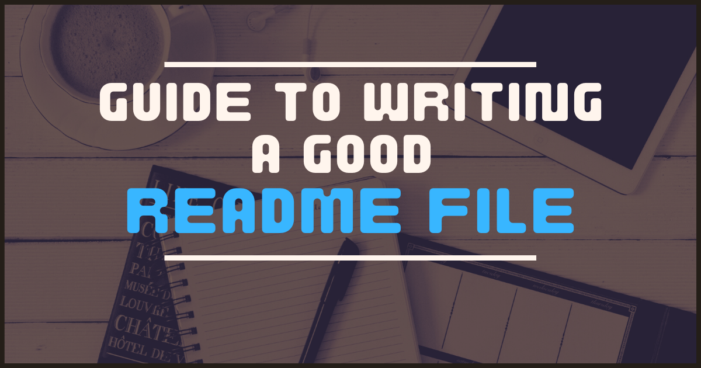

# Überschriften
Mit einer einzelnen Raute '#' schreibt man eine Überschrift:
Es gibt 6 Level von Überschriften:
## Abschnitt
### Kapitel
#### Unterkapitel
##### Was nun?
###### Wirklich?
___

Ich kann Teile meines Readmes trennen mit ___ oder ---

--- 

# Auflistungen

Eine Auflistung schreibe ich mit '*' oder '-':
* Punkt1
    - Unterpunkt
        - Test
- Punkt2
    - UnterPunkt
* Punkt3
    * Unterpunkt

Die Liste kann auch nummeriert sein:

1. Punkt1
    1. Unterpunkt
        1. Unterunterpunkt
        2. Noch ein Unter-Unterpunkt
2. Punkt2


Man kann auch Checkboxen auflisten:

- [x] Checkliste eingebaut
- [ ] Checkliste ist klickbar in Preview?
___
# Zeilenumbrüche

Um eine neue Zeile anzufangen, brauche ich einen line-break.
Dafür gibt es 3 Möglichkeiten:

a) Ich lasse eine extra Zeile frei.  
b) Ich schreibe 2 Leerzeichen am Ende einer Zeile.<br>
c) Oder ich nutze das Zeichen `<br>`

---
# Text Formatierung

Hier seht ihr einige Beispiele zum Formatieren von Text:

- **So** schreibe ich text in bold oder __so__.
- _So_ schreibe ich text in *italics*.
- Man kann das auch ***kombinieren***.
- ~~So~~ schreibe ich durchgestrichenen Text.
- Ich kann wenn ich möchte `Code` in eine Zeile schreiben.
- Oder ich schreibe einen gesamten Code-Block
```Kotlin
var x: Boolean = true
println("Dear Readme, today I ...")
```
<details>
    <summary> Spoiler/ Text verstecken </summary>
Dieser Text wird nur angezeigt wenn ich ihn aufklicke.
</details>

---
# Bilder
Man kann auch Bilder und andere Medien in sein Readme einbauen:


---


___

# Wichtige Links:

Link zum Repo:
[text](https://github.com/SI-Classroom-Batch-018/B18-LiveBeispiele)

IntelliJ Markdown Guide:
https://www.jetbrains.com/help/upsource/markdown-syntax.html#Headings

Offizieller Markdown Guide:
https://www.markdownguide.org/